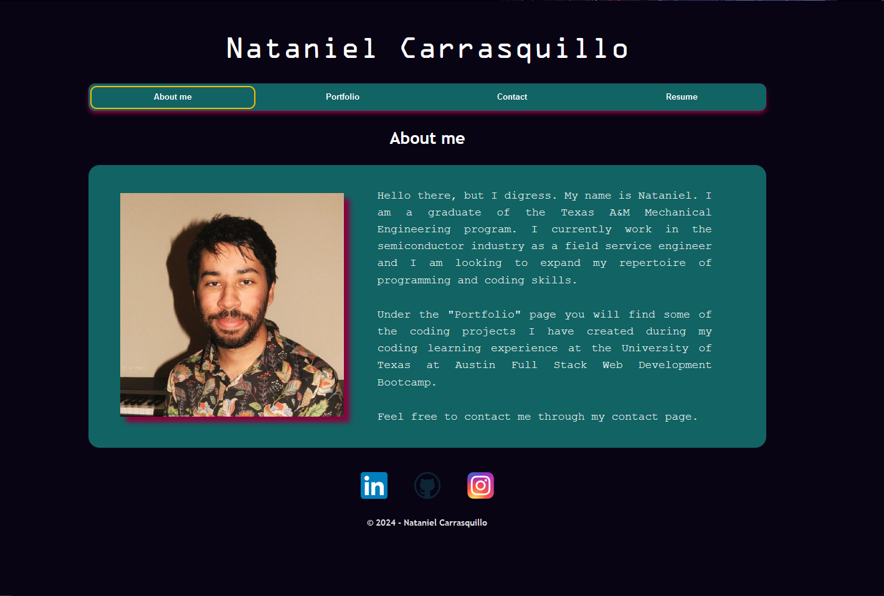
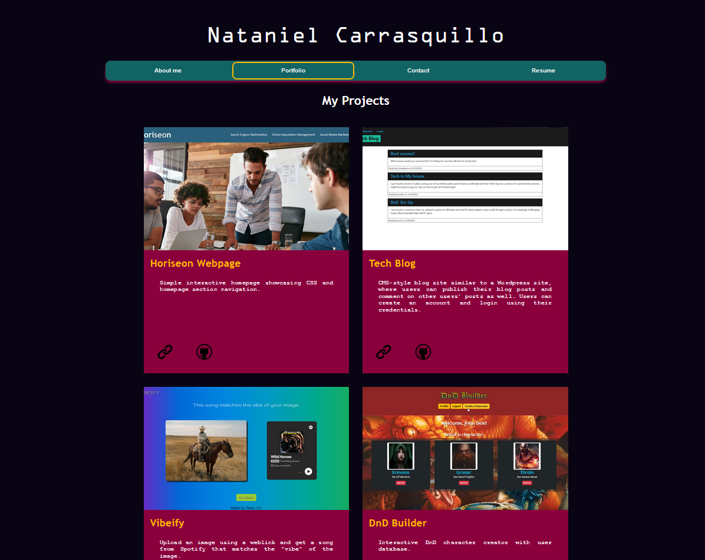
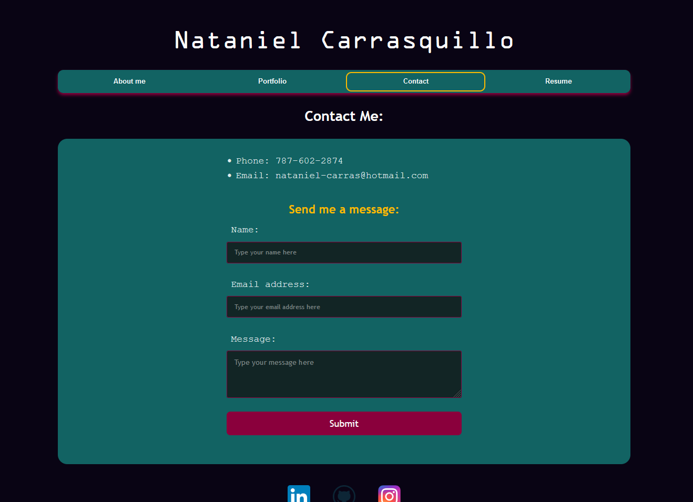
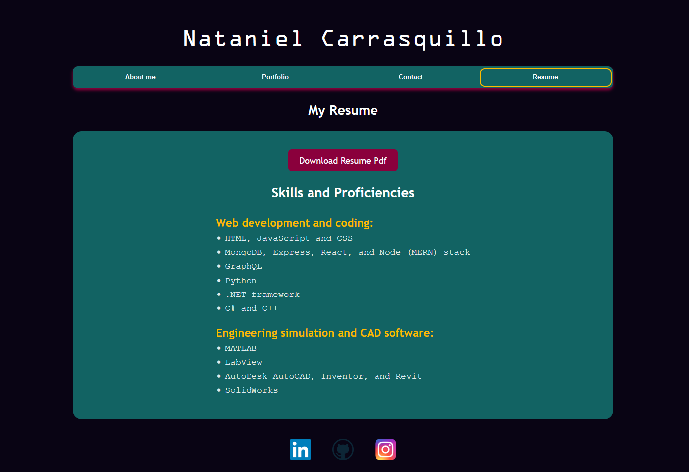

# React Portfolio

## Description:
This is the code I used to create a Single-Page Application (SPA) portfolio using React and Node. The application is deployed using Netlify.

## Website Link:

https://nataniel-c-portfolio.netlify.app/

## Website Screenshots:

---

---

---

---